# DataInsights Task Architecture

This document explains **how the `datainsights-dump-refresh` task runs, where it runs, and how it was set up** — the architecture, not the step-by-step instructions the agent follows (those are in [`TASK.md`](TASK.md)).

It exists so that someone on the research team (e.g., Stu) who wants to build a *new* Cowork task that processes DataInsights pages can hand this file to an LLM and be walked through both the one-time environment setup and how to structure the task. The pattern generalizes to any SSO-gated Tableau/DataInsights export you want to land in a shared folder on a schedule.

---

## 1. What kind of thing this is

A **Claude Cowork task** is a saved set of natural-language instructions that the Claude desktop app runs on a schedule. This task runs **every Monday around 6am, locally on the maintainer's Mac** — the scheduled task is marked "Only on this computer," so it does **not** run in the cloud. The Mac must be on and the Claude desktop app running for it to fire.

The task's job: pull six Tableau "crosstab" exports from Syracuse's DataInsights, verify each one, and write date-stamped `.xlsx` files into the shared **DataInsights Dump** folder (OneDrive), which several downstream analysis skills and colleagues (Dean Mortazavi, Greg Hoke) read from.

## 2. Where the code actually executes (the runtime)

When a Cowork task runs, the agent's shell commands do **not** run on macOS directly. They run inside an **isolated Ubuntu Linux virtual machine** that the Claude desktop app launches on the Mac:

- **OS/arch:** Ubuntu 22.04, ARM64. On Apple Silicon it runs natively on the Mac's own cores via Apple's **Virtualization.framework** (the guest even reports CPU implementer `0x61` = Apple). It is a real VM, not the macOS environment.
- **Filesystem bridge:** the folders you connect to Cowork are exposed inside the VM over a **FUSE mount** at `/sessions/<id>/mnt/<folder-name>`. The Mac's real paths (`/Users/you/...`) **do not exist** inside the VM — only the connected folders appear, each at its own mount point.
- **Filesystem semantics (important):** inside these mounts you can **create, write, and rename** files, but you **cannot delete** them (`unlink` returns "Operation not permitted"). This is a safety property — an automated task physically cannot delete your files — and every task must be designed around it (see §6).
- **Network:** the VM has **restricted egress**. It **cannot reach `github.com`** (no DNS resolution, no SSH key), so `git pull`/`git push` from inside the VM fail. Repository reads/writes must go through the **GitHub connector (MCP)** instead, or be done by the maintainer on their Mac. General web access goes through `web_fetch`/`WebSearch`.
- **Tools:** shell = `mcp__workspace__bash` (runs in the VM); file read/write tools operate on the connected folders; the Chrome connector drives a real Chrome on the Mac (see §4).

## 3. The folder-access model (least privilege)

Cowork only mounts folders **you explicitly connect** ("Add folder" in the app). The agent **cannot mount folders itself** — it has no privileges to do so, and mounting a new Mac directory requires your consent through the app. That consent gate is deliberate.

This task connects **only the `DataInsights Dump` folder** — nothing else. That matters because:

- The Dump is already shared with the Deans, so connecting it grants the task no access it didn't already effectively have.
- Your home folder, `~/Downloads`, and everything else on the Mac stay **invisible** to the task.

The design goal throughout was to keep the task's reach as small as possible while still letting it get files where they need to go.

## 4. The Chrome-profile architecture (the crux of the design)

**The core problem:** Chrome downloads land in `~/Downloads` by default. But `~/Downloads`:
1. isn't a connected folder, so the VM can't see files there; and
2. is full of sensitive personal material (draft personnel documents, etc.) you don't want the task to see — and you *definitely* don't want it copied into the Dean-shared Dump.

**The solution:** a **dedicated Chrome profile** whose **download location is a subfolder inside the connected Dump** (`<Dump>/Downloads`). Then:

- The dedicated profile downloads DataInsights exports straight into `<Dump>/Downloads`, which the VM **can** read (because the Dump is connected).
- Your **normal** Chrome profile keeps downloading to `~/Downloads`, untouched and unseen by the task. Personal downloads never enter the shared Dump.
- The Cowork **Chrome connector** drives whichever Chrome profile has the Claude extension **connected to the same Anthropic account** as the desktop app. That's why the dedicated profile must be signed into the right Anthropic account (see §5).

### Data flow

```mermaid
flowchart LR
    A[DataInsights\nSSO-gated Tableau] -->|Crosstab to Excel| B[Dedicated Chrome profile\n on macOS]
    B -->|downloads into| C["&lt;Dump&gt;/Downloads\n(inside connected folder)"]
    C -->|FUSE mount, read by| D[Cowork Linux VM\n bash + pandas]
    D -->|stage, verify row count| E["hidden .incoming_ file"]
    E -->|rename on pass| F["YYYYMMDD_Name.xlsx\n in DataInsights Dump"]
    F --> G[Downstream skills\n Dean Mortazavi, Greg Hoke]
```

## 5. One-time manual setup (the replicable checklist)

These steps were done **once, by hand**, on the maintainer's Mac. They can't be automated by the agent (they involve account creation and SSO sign-in), so whoever adopts this architecture repeats them. Replace `NetID` below with your own SU NetID.

1. **Create a second Chrome profile** (this one is named "Claude"). Chrome › profile avatar › Add.
2. **Create a dedicated Google account for that profile and sign the profile into it.** In this setup that account is **`NetIDClaude@gmail.com`** — a purpose-made bot account, separate from any personal Google identity. Signing the *profile* into a Google account gives it durable state: it can install and retain extensions, keep settings, and survive restarts. (This is a Google sign-in for the Chrome profile itself — distinct from the Anthropic sign-in in the next step.)
3. **Install the Claude ("Claude in Chrome") extension** in that profile.
4. **Sign the Claude extension into your Anthropic account** — here **`NetID@syr.edu`**, via **Syracuse University SSO**. This is the critical step: the extension must be signed into the **same Anthropic account that the Claude desktop app (which runs Cowork) uses**. That shared identity is what makes the profile show up as a connectable browser to the Cowork Chrome connector. (Note the two different identities in play: the profile is signed into a *Google* account for browser state, and the *extension* is signed into your *Anthropic* account for connector access.)
5. **Set that profile's download location to the Dump intake folder.** Chrome › Settings › Downloads › Location › choose `…/DataInsights Dump/Downloads`. Turn **off** "Ask where to save each file."
6. **Log into DataInsights in that profile via SSO.** The automated runs rely on the session already being authenticated; if SSO/MFA later expires, the task is written to **stop and report** rather than download empty files.
7. **Keep the profile running at run time.** For the unattended 6am run, leave that Chrome profile open or add it to macOS login items, and make sure its extension stays connected. If it isn't connected when the task fires, the task stops (see §7) rather than driving the wrong profile.

## 6. Runtime patterns the task uses (and why)

**Profile self-verification (Step 0).** deviceIds from the Chrome connector are **not stable across reboots**, only one browser connects at a time, and the connector labels them generically ("Browser 1"), so the task can't just hard-code which browser to drive. Instead it does a **probe download**: trigger a tiny throwaway file via JavaScript and confirm it lands in `<Dump>/Downloads/`. If it does, the task is driving the right profile with the right download folder; if not, it stops before touching real data. This turns "am I on the right Chrome?" into a test, not an assumption.

**Delete-free stage → verify → rename.** Because the mount blocks `unlink`, the task never overwrites or deletes to guard quality. It copies each raw download into the Dump under a **hidden `.incoming_…` name**, checks the row count, and only then **renames** it to the final `YYYYMMDD_<Name>.xlsx`. A file that fails verification keeps its hidden name, which matches no downstream glob, so a bad export can never supersede a good one. (Raw downloads accumulate in `<Dump>/Downloads` over time since they can't be deleted — harmless, since their names don't match the consumed pattern.)

**Fail loud.** Downstream skills auto-select the newest file by date-stamped name, so a truncated file written today silently poisons every query. The task treats a failed row-count check, a missing profile, or an SSO prompt as a **stop-and-report**, never a partial write.

## 7. Why this architecture, and what was rejected

The chosen design — **dedicated Chrome profile + Dump-only connection** — was picked after ruling out the alternatives:

- **Connect `~/Downloads` or the home folder:** gives the task standing read/write over sensitive personal files; rejected on least-privilege grounds.
- **Point your normal Chrome's default download folder at the Dump:** your everyday downloads would then flow into the Dean-shared folder; rejected on confidentiality grounds.
- **Symlink from `~/Downloads` into the Dump:** the FUSE mount resolves symlink targets against the Linux VM's root, where the absolute macOS path doesn't exist, so the link dangles inside the VM; mechanically doesn't work.
- **A separate macOS user account for the bot:** strong OS-level isolation, but the unattended local run must occur in whatever account is running the desktop app, which is awkward to keep logged in at 6am — and the FUSE boundary already confines file access to connected folders, so the account boundary adds friction for little marginal containment.

The dedicated-profile approach gets the files where they need to go while the task sees **only** the Dump, with delete blocked as a backstop.

## 8. Building your own DataInsights task with this architecture

If you want a task that processes different DataInsights pages:

1. **Reuse or recreate the bot Chrome profile** from §5 (you can share the same "Claude" profile, or make your own with its own bot Google account). Point its download folder at *your* destination folder's intake subfolder.
2. **Connect only that destination folder** to your Cowork task — keep it minimal.
3. **Write a `TASK.md`** following the repository conventions (see the repo [`README.md`](../README.md)): a metadata header (version, license, maintainer, review cadence, a "parameters that expire" section) plus a runnable body. Model the body on this task's:
   - **Step 0** profile probe (copy it almost verbatim),
   - a **table** of each view with its required filters and a **minimum row count**,
   - the **per-view procedure** (navigate, wait for the slow Tableau render, apply filters, screenshot to confirm, check the view isn't empty, `Crosstab → Excel`),
   - the **stage → verify → rename** finalize step,
   - a **manifest** append and **fail-loud reporting**.
4. **Mind the Tableau gotchas:** views render slowly (wait ~20s); some filters have wrong defaults (e.g., fiscal-year "From" defaulting to a recent year and silently dropping history — always set and screenshot-confirm the intended value); an empty view means don't download.
5. **Remember the runtime limits:** the VM can't reach GitHub (use the connector to commit); it can't delete files; and it only sees connected folders.

---

*Maintainer: Duncan Brown, VP for Research, Syracuse University (Syracuse University OSPO). Licensed under Apache-2.0 (see repository root `LICENSE`).*
